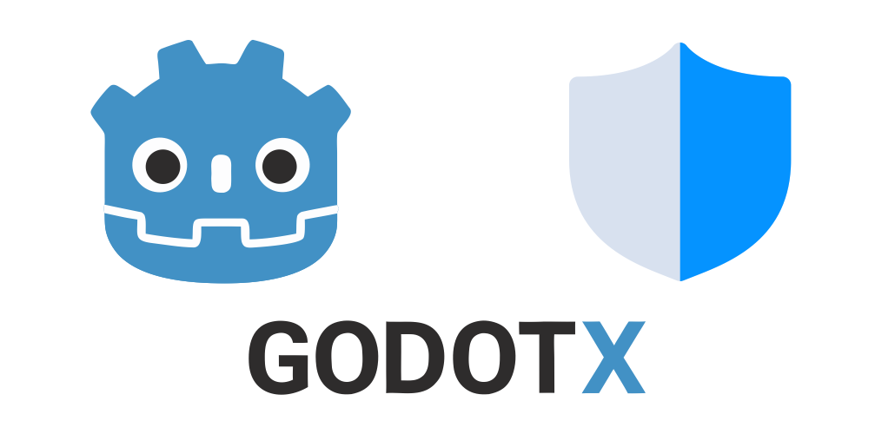
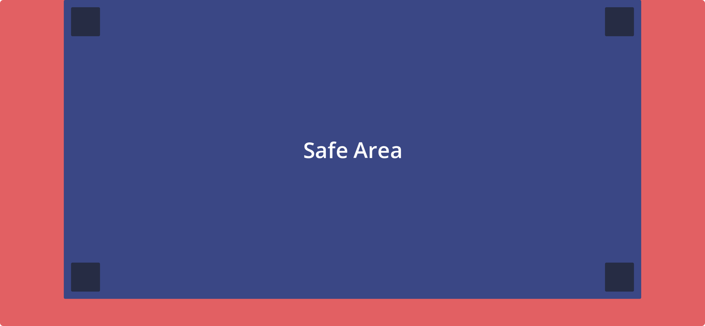

    

# SafeAreaX

SafeAreaX is a lightweight Godot plugin that automatically adapts your UI to fit within the device's **safe area**, preventing overlap with **notches**, **rounded corners**, and **gesture areas** on modern devices.

## Features

- Automatically adjusts margins based on display safe area
- Supports iPhone and Android cutouts
- Optional debug overlay to visualize the safe area
- Easy to integrate with existing UI layouts

## Installation

1. Copy the `addons/SafeAreaX` folder into your Godot project.
2. Enable the plugin in **Project Settings → Plugins**.
3. Add the **SafeAreaX** node to your scene and place your UI elements inside it.

## License

This project is licensed under the [MIT License](addons/SafeAreaX/LICENSE).

---

Made with ❤️ by Paulo Coutinho
